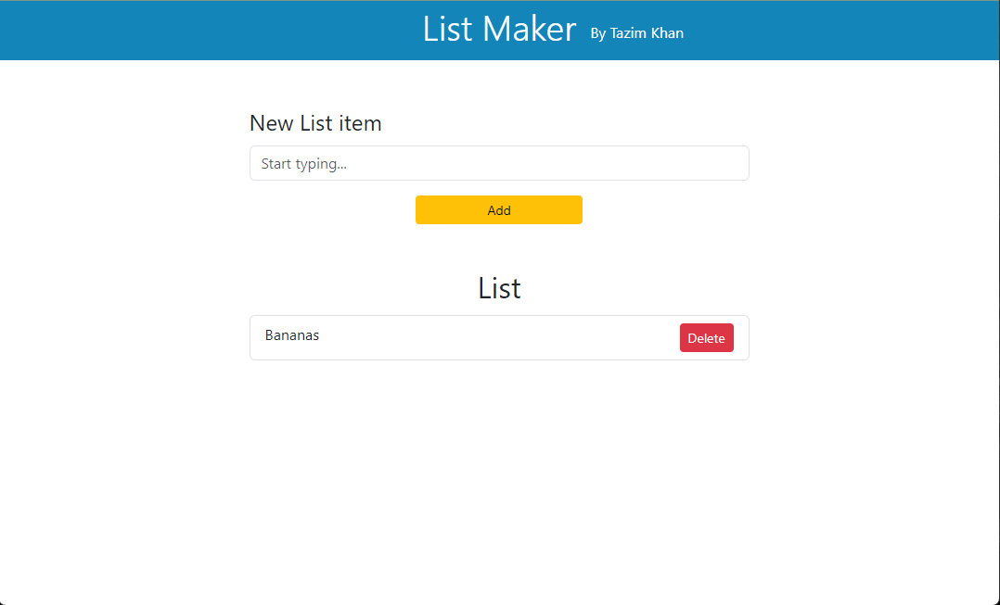

## List Maker

A simple list maker application. The Frontend was built using React, Javascript, CSS, and Bootstrap. The Backend was built using Java Springboot and MySQL.

## Project Status

This project is still currently in progress. Users can add and delete items to the list, which updates the MySQL database and shows on the page. Functionality to sort and edit items is in development. I also plan to add the functionality to create multiple lists.

## Project Screen Shot

## Installation and Setup Instructions

Clone down this repository. You will need `node` and `npm` installed globally on your machine. You will also need XAMPP downloaded to be able to run Apache and MySQL. If these are not running the Backend of the application will not run.

Installation:

`npm install`

To Run Backend:

If you already have Maven installed on your computer with the maven enviornment PATH variable already set, you can simply open the CMD, cd into: Back-End -> listMaker, folder and run: `mvn clean install` then `mvn spring-boot:run`.

If you don't have maven enviornment PATH variable already set, you can also open the project in an IDE (I used Intellij Community Edition) and run the application from there. If you get a pop-up to import Maven please do so. To run the application, run the ListMakerApplication.java file.

To Run Frontend:

Make sure to cd into: Front-End -> list-app, then in the CMD run: `npm run dev`.

